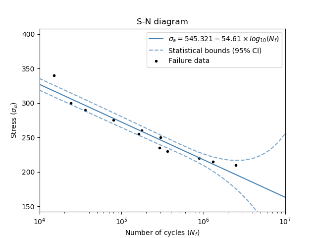
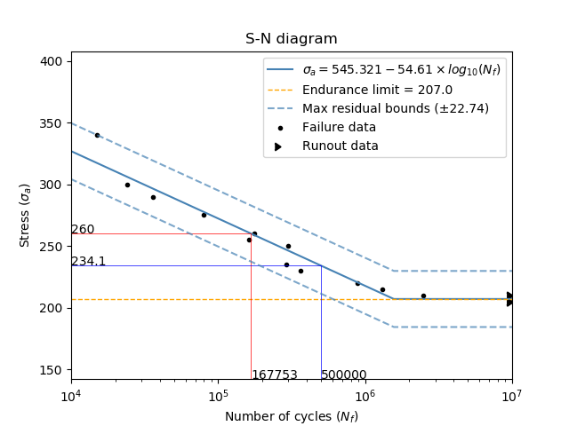

.. image:: images/logo.png

-------------------------------------

SN diagram
''''''''''

This function will plot the stress vs number of cycles (S-N) diagram when supplied with data from a series of fatigue tests. An S-N diagram is a common procedure used to model the fatigue life of metals which are subject to known cyclic loads. Typically, the plot is done using a semilog scale where the number of cycles is scaled logarithmically. This has the effect of linearizing the plot and making the accuracy of the model much easier to visualize. For steels, titanium alloys, and some other metals, there exists an endurance limit. This limit is the minimum stress required to propagate faigue cracks, and all stresses below this endurance limit do not contribute to fatigue growth. The plot can be adjusted to use an endurance limit using the optional inputs, however, there must be runout data (equivalent to right censored data) supplied in order for the program to determine where to set the endurance limit. 

.. admonition:: API Reference

   For inputs and outputs see the `API reference <https://reliability.readthedocs.io/en/latest/API/PoF/SN_diagram.html>`_.

Example 1
---------

In this first example, we use the data for stress and cycles to produce an S-N diagram. We will not provide any runout data here so the endurance limit will not be calculated.

.. code:: python

    from reliability.PoF import SN_diagram
    import matplotlib.pyplot as plt
    stress = [340, 300, 290, 275, 260, 255, 250, 235, 230, 220, 215, 210]
    cycles = [15000, 24000, 36000, 80000, 177000, 162000, 301000, 290000, 361000, 881000, 1300000, 2500000]
    SN_diagram(stress=stress, cycles=cycles)
    plt.show()

Example 2
---------

In this second example, we will use the same data as above, but also supply runout data so that the endurance limit will be calculated. We will also adjust the method_for_bounds to be 'residual'. We are also going to find the life (in cycles) at a stress of 260 by using stress_trace, and the stress required to achieve a life of 5x10^5 cycles using cycles_trace.

.. code:: python

    from reliability.PoF import SN_diagram
    import matplotlib.pyplot as plt
    stress = [340, 300, 290, 275, 260, 255, 250, 235, 230, 220, 215, 210]
    cycles = [15000, 24000, 36000, 80000, 177000, 162000, 301000, 290000, 361000, 881000, 1300000, 2500000]
    stress_runout = [210, 210, 205, 205, 205]
    cycles_runout = [10 ** 7, 10 ** 7, 10 ** 7, 10 ** 7, 10 ** 7]
    SN_diagram(stress=stress, cycles=cycles, stress_runout=stress_runout, cycles_runout=cycles_runout,method_for_bounds='residual',cycles_trace=[5 * 10 ** 5], stress_trace=[260])
    plt.show()

**References:**

- Probabilistic Physics of Failure Approach to Reliability (2017), by M. Modarres, M. Amiri, and C. Jackson. pp. 17-21.
