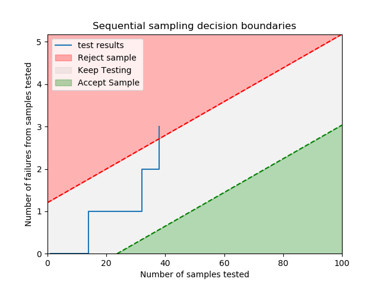

.. image:: images/logo.png

-------------------------------------

Sequential sampling chart
'''''''''''''''''''''''''

A sequential sampling chart provides decision boundaries so that a success/failure test may be stopped as soon as there have been enough successes or enough failures to exceed the decision boundary. The decision boundary is calculated based on four parameters; producer's quality, consumer's quality, producer's risk, and consumer's risk. Producer's risk is the chance that the consumer rejects a batch when they should have accepted it. Consumer's risk is the chance that the consumer accepts a batch when they should have rejected it. We can also consider the producer's and consumer's quality to be the desired reliability of the sample, and the producer's and consumer's risk to be 1-confidence interval that the sample test result matches the population test result.

.. admonition:: API Reference

   For inputs and outputs see the `API reference <https://reliability.readthedocs.io/en/latest/API/Reliability_testing/sequential_sampling_chart.html>`_.

In the example below, we use the inputs p1=0.01, p2=0.10, alpha=0.05, beta=0.10. The resulting decision boundaries are plotted, and the test results that we have supplied are also plotted as a stepped line. The plot shows that after our 3rd failure, the test should be stopped as the batch can be rejected. The dataframe of results is also printed by default. In this dataframe, the value of x is used to replace impossible numbers, ie. we cannot reject 2 failures if we have only conducted 1 inspection. This example is based on an example in the `Engineering statistics handbook <https://itl.nist.gov/div898/handbook/pmc/section2/pmc26.htm>`_ published online by NIST.

.. code:: python

    from reliability.Reliability_testing import sequential_samling_chart
    test_results = [0,0,0,0,0,0,0,0,0,0,0,0,0,1,0,0,0,0,0,0,0,0,0,0,0,0,0,0,0,0,0,1,0,0,0,0,0,1]
    sequential_samling_chart(p1=0.01,p2=0.10,alpha=0.05,beta=0.10,test_results=test_results)

    '''
    Results from sequential_sampling_chart:
     Samples Failures to accept Failures to reject
           0                  x                  x
           1                  x                  x
           2                  x                  2
           3                  x                  2
           4                  x                  2
           5                  x                  2
           6                  x                  2
           7                  x                  2
           8                  x                  2
           9                  x                  2
          10                  x                  2
          11                  x                  2
          12                  x                  2
          13                  x                  2
          14                  x                  2
          15                  x                  2
          16                  x                  2
          17                  x                  2
          18                  x                  2
          19                  x                  2
          20                  x                  3
          21                  x                  3
          22                  x                  3
          23                  x                  3
          24                  0                  3
          25                  0                  3
          26                  0                  3
          27                  0                  3
          28                  0                  3
          29                  0                  3
          30                  0                  3
          31                  0                  3
          32                  0                  3
          33                  0                  3
          34                  0                  3
          35                  0                  3
          36                  0                  3
          37                  0                  3
          38                  0                  3
          39                  0                  3
          40                  0                  3
          41                  0                  3
          42                  0                  3
          43                  0                  3
          44                  0                  3
          45                  0                  3
          46                  0                  4
          47                  0                  4
          48                  0                  4
          49                  1                  4
          50                  1                  4
          51                  1                  4
          52                  1                  4
          53                  1                  4
          54                  1                  4
          55                  1                  4
          56                  1                  4
          57                  1                  4
          58                  1                  4
          59                  1                  4
          60                  1                  4
          61                  1                  4
          62                  1                  4
          63                  1                  4
          64                  1                  4
          65                  1                  4
          66                  1                  4
          67                  1                  4
          68                  1                  4
          69                  1                  4
          70                  1                  4
          71                  1                  5
          72                  1                  5
          73                  1                  5
          74                  2                  5
          75                  2                  5
          76                  2                  5
          77                  2                  5
          78                  2                  5
          79                  2                  5
          80                  2                  5
          81                  2                  5
          82                  2                  5
          83                  2                  5
          84                  2                  5
          85                  2                  5
          86                  2                  5
          87                  2                  5
          88                  2                  5
          89                  2                  5
          90                  2                  5
          91                  2                  5
          92                  2                  5
          93                  2                  5
          94                  2                  5
          95                  2                  5
          96                  2                  6
          97                  2                  6
          98                  2                  6
          99                  2                  6
         100                  3                  6 
    '''

