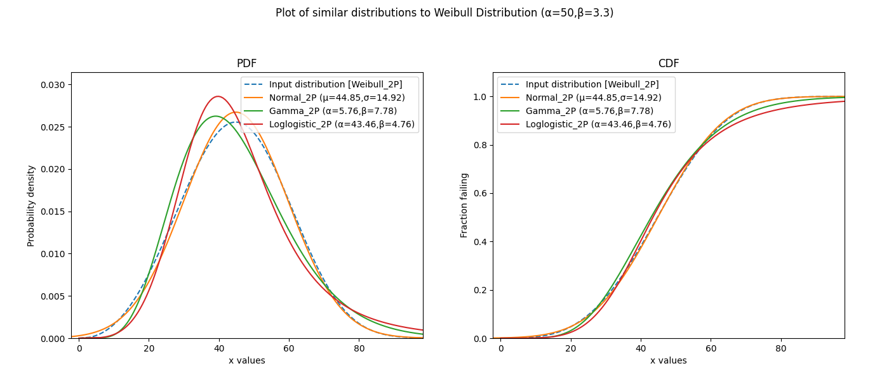

.. image:: images/logo.png

-------------------------------------

Similar Distributions
'''''''''''''''''''''

The function `similar_distributions` is a tool for finding the probability distributions that are most similar to an input distribution.
It samples the CDF of an input distribution and then fits all other distributions to those samples to determine the best fitting and therefore most similar distributions.

.. admonition:: API Reference

   For inputs and outputs see the `API reference <https://reliability.readthedocs.io/en/latest/API/Other_functions/similar_distributions.html>`_.

In the example below, we create a Weibull Distribution object using the reliability.Distributions module. We then provide the Weibull Distribution as input to `similar_distributions` and the output reveals the top 3 most similar distributions. The optional input of include_location_shifted has been set to False.

.. code:: python

    from reliability.Distributions import Weibull_Distribution
    from reliability.Other_functions import similar_distributions
    dist = Weibull_Distribution(alpha=50,beta=3.3)
    similar_distributions(distribution=dist,include_location_shifted=False)

    '''
    Results from similar_distributions:
    The input distribution was:
    Weibull Distribution (α=50,β=3.3)

    The top 3 most similar distributions are:
    Normal Distribution (μ=44.8471,σ=14.9226)
    Gamma Distribution (α=5.7607,β=7.785)
    Loglogistic Distribution (α=43.465,β=4.7564)
    '''
    

