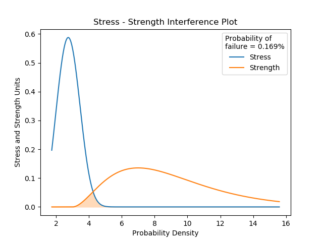
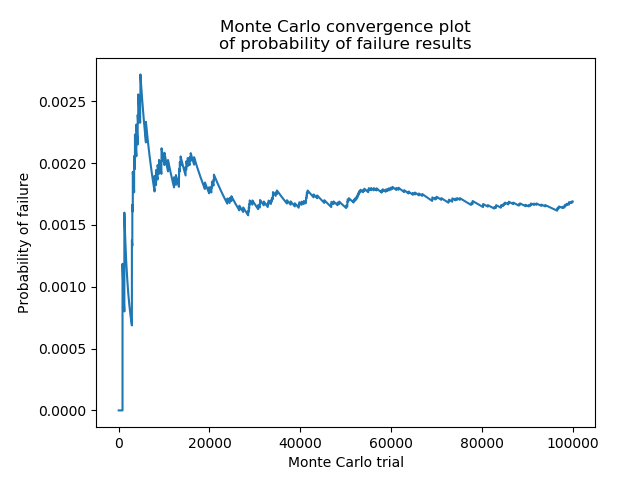

.. image:: images/logo.png

-------------------------------------

Stress-Strength interference for any distributions
''''''''''''''''''''''''''''''''''''''''''''''''''

Stress-Strength interference is a model to predict the probability of failure when the probability distributions of the stress and the strength are known. The model calculates the probability of failure by determining the probability that a random stress (drawn from a stress distribution) is greater than a random strength (drawn from a strength distribution). It does this using a large number of monte carlo trials and averaging the results. The more trials that are performed, the more accurate the result will be. Since this process involves using random numbers, the result is never exact, but it will approach the exact solution as the number of trials approaches infinity.

If both the stress and strength distributions are normal distributions, then there exists a simple analytical solution which will give an exact result. For this method, use the function `Probability_of_failure_normdist <https://reliability.readthedocs.io/en/latest/Stress-Strength%20interference%20for%20normal%20distributions.html>`_

Inputs:

-   stress - a probability distribution from the Distributions module
-   strength - a probability distribution from the Distributions module
-   monte_carlo_trials - number of MC trials (default is 100000)
-   show_distribution_plot - True/False (default is True)
-   show_convergence_plot - True/False (default is True)
-   print_results - True/False (default is True)

Outputs:

-   prob_of_failure - the probability of failure
-   the distribution plot (only shown if show_distribution_plot=True)
-   the convergence plot (only shown if show_convergence_plot=True)
-   results printed to console (only shown if print_results=True)

In this first example, we will create a stress and strength distribution, and leaving everything else as dafault, we will see the reulsts and convergence plot.

.. code:: python

    from reliability import Distributions
    from reliability.Stress_strength import Probability_of_failure
    stress = Distributions.Weibull_Distribution(alpha=2, beta=3, gamma=1)
    strength = Distributions.Gamma_Distribution(alpha=2, beta=3, gamma=3)
    result = Probability_of_failure(stress=stress, strength=strength)
    
    '''
    Probability of failure: 0.00169
    '''

Note that in the convergence plot, the probability of failure varies randomly when the number of monte carlo trials is small, but as the number of trials is increased, the probability of failure approaches a constant, which will be the exact solution as monte carlo trials approaches infinity.
