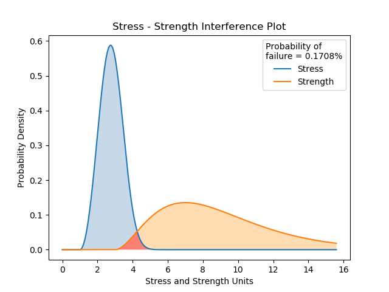

.. image:: images/logo.png

-------------------------------------

Stress-Strength interference for any distributions
''''''''''''''''''''''''''''''''''''''''''''''''''

Stress-Strength interference is a model to predict the probability of failure when the probability distributions of the stress and the strength are known. Failure is defined as when stress > strength. The model calculates the probability of failure through integration.

If both the stress and strength distributions are normal distributions, then there exists a simple analytical solution which will give an exact result. For this method, use the function `Probability_of_failure_normdist <https://reliability.readthedocs.io/en/latest/Stress-Strength%20interference%20for%20normal%20distributions.html>`_. For two Normal distributions, the difference between the integration method and the analytical method is very small (around 1e-11).

Inputs:

-   stress - a probability distribution from the Distributions module
-   strength - a probability distribution from the Distributions module
-   show_distribution_plot - True/False (default is True)
-   print_results - True/False (default is True)
-   warn - a warning will be issued if both stress and strength are Normal as you should use Probability_of_failure_normdist. You can supress this using warn=False

Outputs:

-   the probability of failure
-   the distribution plot (only shown if show_distribution_plot=True)
-   results printed to console (only shown if print_results=True)

In this example, we will create a stress and strength distribution, and leaving everything else as dafault, we will see the results printed and the distribution plot.

.. code:: python

    from reliability import Distributions
    from reliability.Stress_strength import Probability_of_failure
    import matplotlib.pyplot as plt

    stress = Distributions.Weibull_Distribution(alpha=2, beta=3, gamma=1)
    strength = Distributions.Gamma_Distribution(alpha=2, beta=3, gamma=3)
    result = Probability_of_failure(stress=stress, strength=strength)
    plt.show()
    
    '''
    Probability of failure: 0.0017078240697779028
    '''

.. note:: In Version 0.5.0 the calculation method was changed from monte-carlo to integration. This resulted in an API change. See the `Changelog <https://reliability.readthedocs.io/en/latest/Changelog.html>`_ for details.

Easter Egg: The logo for ``reliability`` was created using the stress strength interference plot of two Weibull distributions.
