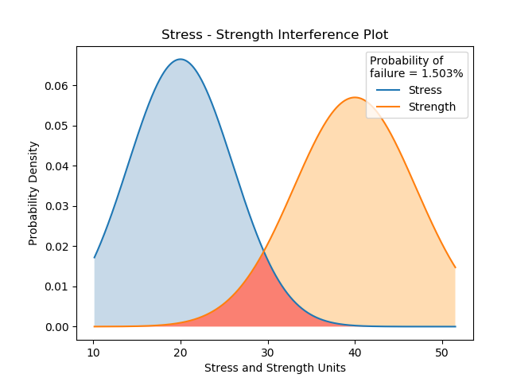

.. image:: images/logo.png

-------------------------------------

Stress-Strength interference for normal distributions
'''''''''''''''''''''''''''''''''''''''''''''''''''''

Stress-Strength interference is a model to predict the probability of failure when the probability distributions of the stress and the strength are known. The model calculates the probability of failure by determining the probability that a random stress (drawn from a stress distribution) is greater than a random strength (drawn from a strength distribution). If you are working with stress and strength distributions that are not both Normal distributions, then you will need to use the integration method provided in `Probability_of_failure <https://reliability.readthedocs.io/en/latest/Stress-Strength%20interference%20for%20any%20distributions.html>`_. However, if both the stress and strength distributions are Normal distributions then the exact solution can be found using an analytical approach provided here in ``Probability_of_failure_normdist``.

Inputs:

-   stress - a Normal probability distribution from the Distributions module
-   strength - a Normal probability distribution from the Distributions module
-   show_distribution_plot - True/False (default is True)
-   print_results - True/False (default is True)

Outputs:

-   the probability of failure
-   the distribution plot (only shown if show_distribution_plot=True)
-   results printed to console (only shown if print_results=True)

In this example, we will create a stress and strength distribution (both of which are Normal distributions), and leaving everything else as default, we will see the results plotted and printed. Unlike the integration method this approach is analytical, though a comparison of the two methods reveals the error in the integration method is negligible (around 1e-11).

.. code:: python

    from reliability import Distributions
    from reliability.Stress_strength import Probability_of_failure_normdist
    import matplotlib.pyplot as plt
    stress = Distributions.Normal_Distribution(mu=20,sigma=6)
    strength = Distributions.Normal_Distribution(mu=40,sigma=7)
    result = Probability_of_failure_normdist(stress=stress, strength=strength)
    plt.show()
    
    '''
    Probability of failure: 0.015029783946206214
    '''

