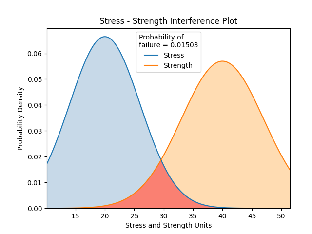

.. image:: images/logo.png

-------------------------------------

Stress-Strength interference
''''''''''''''''''''''''''''

Stress-Strength interference is a model to predict the probability of failure when the stress and strength probability distributions are known. Failure is defined as when stress > strength. If both the stress and strength distributions are Normal Distributions, then there exists a simple analytical solution which will give an exact result. To calculate stress-strength intereference between distributions other than Normal Distributons requires the evaluation of an integral. These two cases are shown below using the functions stress_strength_normal (for two Normal Distributions) and stress_strength (for any two distributions).

Stress-Strength Interference for two Normal Distributions
---------------------------------------------------------

The probability of failure for two Normal distributions is found using the equation:

:math:`\text{Probability of failure} =\Phi \left(\frac{\mu_{strength}-\mu_{stress}}{\sqrt{\sigma_{strength}^{2}+\sigma_{stress}^{2}}}\right)`

Where :math:`\Phi` is the standard Normal CDF with :math:`\mu=0` and :math:`\sigma=1` 

Inputs:

-   stress - a Normal probability distribution from the Distributions module
-   strength - a Normal probability distribution from the Distributions module
-   show_distribution_plot - True/False (default is True)
-   print_results - True/False (default is True)

Outputs:

-   the probability of failure
-   the distribution plot (only shown if show_distribution_plot=True)
-   results printed to console (only shown if print_results=True)

Example 1
*********

In this example, we will create a stress and strength distribution (both of which are Normal distributions), and leaving everything else as default, we will see the results plotted and printed.

.. code:: python

    from reliability import Distributions
    from reliability.Other_functions import stress_strength_normal
    import matplotlib.pyplot as plt
    
    stress = Distributions.Normal_Distribution(mu=20,sigma=6)
    strength = Distributions.Normal_Distribution(mu=40,sigma=7)
    stress_strength_normal(stress=stress, strength=strength)
    plt.show()
    
    '''
    Stress - Strength Interference
    Stress Distribution: Normal Distribution (μ=20,σ=6)
    Strength Distribution: Normal Distribution (μ=40,σ=7)
    Probability of failure (stress > strength): 1.50298 %
    '''

Stress-Strength Interference for any two Distributions
------------------------------------------------------

If either the stress or strength distributions are not Normal Distributions, the analytical method above can not be used and integration is required.

The equation to find the probability of failure any two distributions is:

:math:`\text{Probability of failure} =\int^{\infty}_{0} \left( f_{stress} \times F_{strength} \right)`

Where :math:`f` is the PDF and :math:`F` is the CDF. The above integral can be evaluated using the trapz function in numpy: ``F = np.trapz(stress.PDF(x) * strength.CDF(x), x)``

Inputs:

-   stress - a probability distribution from the Distributions module
-   strength - a probability distribution from the Distributions module
-   show_distribution_plot - True/False (default is True)
-   print_results - True/False (default is True)
-   warn - a warning will be issued if both stress and strength are Normal as you should use stress_strength_normal. You can supress this using warn=False

Outputs:

-   the probability of failure
-   the distribution plot (only shown if show_distribution_plot=True)
-   results printed to console (only shown if print_results=True)

Example 2
*********

In this example, we will create a Weibull stress distribution and a Gamma strength distribution, and leaving everything else as default, we will see the results printed and the distribution plot.

.. code:: python

    from reliability import Distributions
    from reliability.Other_functions import stress_strength
    import matplotlib.pyplot as plt

    stress = Distributions.Weibull_Distribution(alpha=2, beta=3, gamma=1)
    strength = Distributions.Gamma_Distribution(alpha=2, beta=3, gamma=3)
    stress_strength(stress=stress, strength=strength)
    plt.show()
    
    '''
    Stress - Strength Interference
    Stress Distribution: Weibull Distribution (α=2,β=3,γ=1.0)
    Strength Distribution: Gamma Distribution (α=2,β=3,γ=3)
    Probability of failure (stress > strength): 0.17078 %
    '''

.. image:: images/stress_strength_V4.png

.. note:: Prior to version 0.5.5 these two functions were part of a module called Stress_strength and had the names Stress_strength.Probability_of_failure_normdist and Stress_strength.Probability_of_failure. Since these were the only two functions in the Stress_strength module, the decision was made to move these functions into the Other_functions module and rename them. The previous functions will still run and a DeprecationWarning will be shown, but the previous functions will be fully deprecated in mid-2021. See 0.5.5 release notes in the `Changelog <https://reliability.readthedocs.io/en/latest/Changelog.html>`_ for details.
