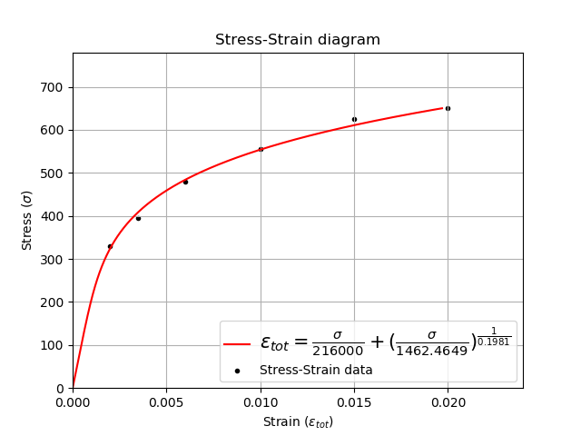
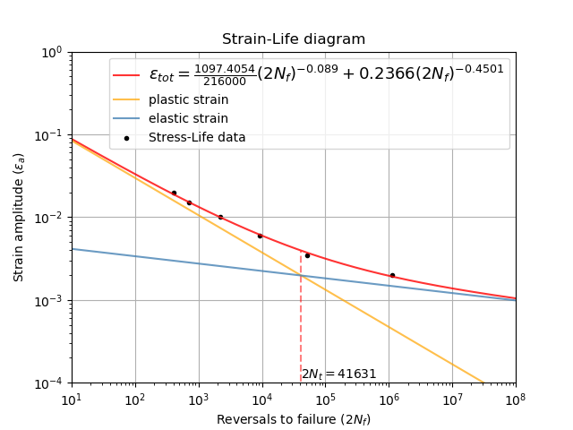
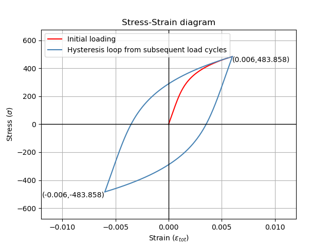
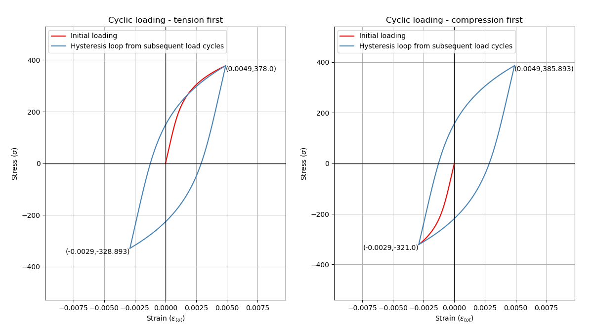
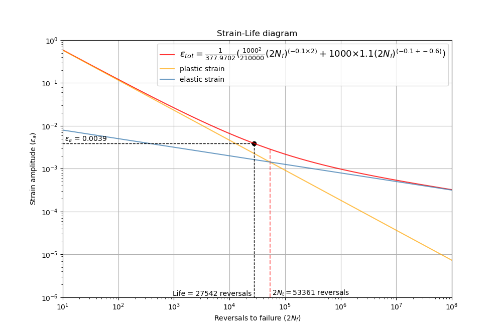

.. image:: images/logo.png

-------------------------------------

Stress-strain and strain-life
'''''''''''''''''''''''''''''

In the strain-life method of fatigue analysis, the elastic and plastic deformation of the material is used to determine how many cycles the material will last before failure. In this context, failure is defined as the formation of a small crack (typically 1mm) so the geometry of the material does not need to be considered provided the material peoperties have been accurately measured using a stress-strain test. This section of the documentation describes three functions which are useful in strain-life analysis. The first of these is useful to fit the stress-strain and strain-life models to available data, thereby providing the material properties. The second function is a diagram of the relationship between stress and strain during cyclic fatigue which shows the hysteresis loop and finds the min and max stress and strain. The third function produces the strain-life diagram and the equations for this diagram are used for calculating the number of cycles to failure. Further detail is available below for each of the respective functions.

The equations used for stress-strain and strain life are:

:math:`\text{Ramberg-Osgood equation:} \hspace{41mm} \varepsilon_{tot} = \underbrace{\frac{\sigma}{E}}_{\text{elastic}} + \underbrace{\left(\frac{\sigma}{K}\right)^{\frac{1}{n}}}_{\text{plastic}}`

:math:`\text{Hysteresis curve equation:} \hspace{43mm} \Delta\varepsilon = \underbrace{\frac{\Delta\sigma}{E}}_{\text{elastic}} + \underbrace{2\left(\frac{\Delta\sigma}{2K}\right)^{\frac{1}{n}}}_{\text{plastic}}`

:math:`\text{Coffin-Manson equation:} \hspace{46mm} \varepsilon_{tot} = \underbrace{\frac{\sigma_f}{E}\left(2N_f\right)^b}_{\text{elastic}} + \underbrace{\varepsilon_f\left(2N_f\right)^c}_{\text{plastic}}`

:math:`\text{Morrow Mean Stress Correction:} \hspace{30mm} \varepsilon_{tot} = \underbrace{\frac{\sigma_f-\sigma_m}{E}\left(2N_f\right)^b}_{\text{elastic}} + \underbrace{\varepsilon_f\left(2N_f\right)^c}_{\text{plastic}}`

:math:`\text{Modified Morrow Mean Stress Correction:} \hspace{10mm} \varepsilon_{tot} = \underbrace{\frac{\sigma_f-\sigma_m}{E}\left(2N_f\right)^b}_{\text{elastic}} + \underbrace{\varepsilon_f\left(\frac{\sigma_f-\sigma_m}{\sigma_f}\right)^{\frac{c}{b}}\left(2N_f\right)^c}_{\text{plastic}}`

:math:`\text{Smith-Watson-Topper Mean Stress Correction:} \hspace{2mm} \varepsilon_{tot} = \underbrace{\frac{\sigma_f^2}{\sigma_{max}E}\left(2N_f\right)^{2b}}_{\text{elastic}} + \underbrace{\frac{\sigma_f\varepsilon_f}{\sigma_{max}}\left(2N_f\right)^{b+c}}_{\text{plastic}}`

Stress-Strain and Strain-Life parameter estimation
--------------------------------------------------

The function ``stress_strain_life_parameters_from_data`` will use stress and strain data to calculate the stress-strain parameters (K, n) from the Ramberg-Osgood relationship.
If cycles is provided it will also produce the strain-life parameters (sigma_f, epsilon_f, b, c) from the Coffin-Manson equation.
You cannot find the strain-life parameters without stress as we must use stress to find elastic strain.
Note that if you already have the parameters K, n, sigma_f, epsilon_f, b, c, then you can use the functions 'stress_strain_diagram' or 'strain_life_diagram' as described below.

Inputs:

- strain - an array or list of strain
- stress - an array or list of stress
- E - The modulus of elasticity. Ensure this is in the same units as stress (typically MPa)
- cycles - the number of cycles to failure. Optional input. Required if you want to obtain the parameters sigma_f, epsilon_f, b, c
- print_results - True/False. Default is True.
- show_plot - True/False. Default is True.

Outputs:

- The stress-strain plot will a be generated if show_plot is True. If cycles is provided then the strain-life plot will also be generated. Use plt.show() to show any plots.
- The results will be printed in the console if print_results is True.
- K - the cyclic strength coefficient
- n - the cyclic strain hardening exponent
- sigma_f - the fatigue strength coefficient. Only generated if cycles is provided.
- epsilon_f - the fatigue strain coefficient. Only generated if cycles is provided.
- b - the elastic strain exponent. Only generated if cycles is provided.
- c - the plastic strain exponent. Only generated if cycles is provided.

Note that the parameters generated are stored to an object, so you may find it useful to use this function with print_results=False and show_plot=False, and then access the calculated parameters later. This is done in the first example for the section on stress-strain diagram.

In the example below, we provide data from a fatigue test including stress, strain, and cycles to failure. We must also provide the modulus of elasticity (E) for the material. All other options are left as default values. The plots shown below are provided and the results are printed to the console.  

.. code:: python

    from reliability.PoF import stress_strain_life_parameters_from_data
    import matplotlib.pyplot as plt
    strain_data = [0.02, 0.015, 0.01, 0.006, 0.0035, 0.002]
    stress_data = [650, 625, 555, 480, 395, 330]
    cycles_data = [200, 350, 1100, 4600, 26000, 560000]
    params = stress_strain_life_parameters_from_data(stress=stress_data, strain=strain_data,cycles=cycles_data, E=216000)
    plt.show()

    '''
    K (cyclic strength coefficient): 1462.4649152172044
    n (strain hardening exponent): 0.19810419512368083
    sigma_f (fatigue strength coefficient): 1097.405402055844
    epsilon_f (fatigue strain coefficient): 0.23664541556833998
    b (elastic strain exponent): -0.08898339316495743
    c (plastic strain exponent): -0.4501077996416115
    '''

Stress-Strain diagram
---------------------

The function ``stress_strain_diagram`` is used to visualize how the stress and strain vary with successive load cycles as described by the hysteresis curve equation. Due to residual tensile and compressive stresses, the stress and strain in the material does not unload in the same way that it loads. This results in a hysteresis loop being formed and this is the basis for crack propagation in the material leading to fatigue failure. The size of the hysteresis loop increases for higher strains. Fatigue tests are typically strain controlled; that is they are subjected to a specified amount of strain throughout the test, typically in a sinusoidal pattern. Fatigue tests may also be stress controlled, whereby the material is subjected to a specified amount of stress. This function accepts either input (max_stress or max_strain) and will find the corresponding stress or strain as required. If you do not specify min_stress or min_strain then it is assumed to be negative of the maximum value.

The cyclic loading sequence defaults to begin with tension, but can be changed using initial_load_direction='compression'. If your test begins with compression it is important to specify this as the residual stresses in the material from the initial loading will affect the results for the first reversal. This difference is caused by the Bauschinger effect. Only the initial loading and the first two reversals are plotted. For most materials the shape of the hysteresis loop will change over many hundreds of cycles as a result of fatigue hardening (also known as work-hardening) or fatigue-softening. More on this process is available in the `eFatigue training documents <https://www.efatigue.com/training/Chapter_5.pdf>`_. 

Note that if you do not have the parameters K, n, but you do have stress and strain data then you can use the function 'stress_strain_life_parameters_from_data'. This will be shown in the first example below.

Inputs:

- K - cyclic strength coefficient
- n - strain hardening exponent
- E - The modulus of elasticity. Ensure this is in the same units for which K and n were obtained (typically MPa)
- max_strain - the maximum strain to use for cyclic loading when plotting the hysteresis loop.
- max_stress - the maximum stress to use for cyclic loading when plotting the hysteresis loop. When specifying min and max stress or strain, do not specify both stress and strain as the corresponding value will be automatically calculated.
- min_strain - if this is not -max_strain then specify it here. Optional input.
- min_stress - if this is not -max_stress then specify it here. Optional input.
- initial_load_direction - 'tension' or 'compression'. Default is 'tension'.

Outputs:

- The stress-strain plot will always be generated. Use plt.show() to show it.
- If print_results is True, the calculated parameters below will be printed.
- max_stress
- max_strain
- min_stress
- min_strain

In the example below, we are using the same data from the first example, but this time, we will store the calculated parameters in an object named 'params'. Then we can specify the calculated parameters to the stress_strain_diagram function. The hysteresis loop generated is for a strain-controlled fatigue test where the strain goes from -0.006 to +0.006.

.. code:: python

    from reliability.PoF import stress_strain_life_parameters_from_data, stress_strain_diagram
    import matplotlib.pyplot as plt
    strain_data = [0.02, 0.015, 0.01, 0.006, 0.0035, 0.002]
    stress_data = [650, 625, 555, 480, 395, 330]
    cycles_data = [200, 350, 1100, 4600, 26000, 560000]
    params = stress_strain_life_parameters_from_data(stress=stress_data, strain=strain_data, cycles=cycles_data, E=216000, show_plot=False, print_results=False)
    stress_strain_diagram(E = 216000,n = params.n, K = params.K, max_strain=0.006)
    plt.show()

    '''
    Max stress: 483.85816239406745
    Min stress: -483.8581623940621
    Max strain: 0.006
    Min strain: -0.006
    '''

In this second example, we will use the stress_strain_diagram to visualise the effects of residual stresses for a material subjected to non-zero mean stress. The material parameters (K and n) are already known so we do not need to obtain them from any data. We specify the max_stress is 378 MPa and the min_stress is -321 MPa. We will do this for two scenarios; initial tensile load, and initial compressive load. Upon inspection of the results we see for the initial tensile load, the min_stress in the material is actually -328.893 MPa which exceeds the min_stress we specified in our test. When we have an initial compressive load, the max_stress is 385.893 MPa which exceeds the max_stress we specified in our test. These results are not an error and are caused by the residual stresses in the material that were formed during the first loading cycle. In the case of an initial tensile load, when the material was pulled apart in tension by an external force, the material pulls back but due to plastic deformation, these internal forces in the material are not entirely removed, such that when the first compressive load peaks, the material's internal stresses add to the external compressive forces. This phenomenon is important in load sequence effects for variable amplitude fatigue.

.. code:: python

    from reliability.PoF import stress_strain_diagram
    import matplotlib.pyplot as plt
    plt.figure()
    plt.subplot(121)
    print('Tension first:')
    stress_strain_diagram(E=210000, K = 1200, n = 0.2, max_stress=378,min_stress=-321,initial_load_direction='tension')
    plt.title('Cyclic loading - tension first')
    plt.subplot(122)
    print('Compression first:')
    stress_strain_diagram(E=210000, K = 1200, n = 0.2, max_stress=378,min_stress=-321,initial_load_direction='compression')
    plt.title('Cyclic loading - compression first')
    plt.gcf().set_size_inches(12,7)
    plt.show()

    '''
    Tension first:
    Max stress: 378.0
    Min stress: -328.8931121800317
    Max strain: 0.004901364196875
    Min strain: -0.0028982508530831477
    Compression first:
    Max stress: 385.8931121800323
    Min stress: -320.99999999999943
    Max strain: 0.004901364196875
    Min strain: -0.0028982508530831477
    '''

Strain-Life diagram
-------------------

The function ``strain_life_diagram`` provides a visual representation of the Coffin-Manson relationship between strain and life. In this equation, strain is split into elastic strain and plastic strain which are shown on the plot as straight lines (on a log-log scale), and life is represented by reversals (with 2 reversals per cycle). The total strain amplitude is used to determine the fatigue life by solving the Coffin-Manson equation. When a min_stress or min_strain is specified that results in a non-zero mean stress, there are several mean stress correction methods that are available. These are 'morrow', 'modified_morrow' (also known as Manson-Halford) , and 'SWT' (Smith-Watson-Topper). The default method is 'SWT' but can be changed using the options described below. The equation used is displayed in the legend of the plot. Also shown on the plot is the life of the material at the specified strain amplitude, and the transition life (2Nt) for which the material failure transitions from being dominated by plastic strain to elastic strain.

Note that if you do not have the parameters sigma_f, epsilon_f, b, c, but you do have stress, strain, and cycles data then you can use the function 'stress_strain_life_parameters_from_data'.

The residual stress in a material subjected to non-zero mean stress (as shown in the previous example) are not considered in this analysis, and the specified max and min values for stress or strain are taken as the true values to which the material is subjected.

Inputs:

- E - The modulus of elasticity. Ensure this is in the same units for which K and n were obtained (typically MPa)
- sigma_f - fatigue strength coefficient
- epsilon_f - fatigue strain coefficient
- b - elastic strain exponent
- c - plastic strain exponent
- K - cyclic strength coefficient. Optional input. Only required if you specify max_stress or max_strain.
- n - strain hardening exponent. Optional input. Only required if you specify max_stress or max_strain.
- max_stress - specify the max_stress if you want cycles to failure. If specified, you will also need to specify K and n.
- max_strain - specify the max_strain if you want cycles to failure.
- min_stress - if this is not -max_stress then specify it here. Optional input.
- min_strain - if this is not -max_strain then specify it here. Optional input. When specifying min and max stress or strain, do not specify both stress and strain as the corresponding value will be automatically calculated. Only specify the min if it is not -max
- mean_stress_correction_method - must be either 'morrow','modified_morrow', or 'SWT'. Default is 'SWT'. This is only used if mean_stress is found to be non-zero.
- print_results - True/False. Defaults to True. If use_level_stress or use_level_strain is specified then the printed results will be the cycles_to_failure
- show_plot - True/False. Default is True

Outputs:

- The strain-life plot will be generated if show_plot = True. Use plt.show() to show it.
- cycles_to_failure - only calculated if max_stress OR max_strain is specified. This will be printed if print_results = True.

.. code:: python

    from reliability.PoF import strain_life_diagram
    import matplotlib.pyplot as plt
    strain_life_diagram(E=210000, sigma_f=1000, epsilon_f=1.1, b = -0.1,c=-0.6, K = 1200, n = 0.2, max_strain=0.0049, min_strain=-0.0029)
    plt.show()

    '''
    Failure will occur in 13771.39 cycles (27542.78 reversals).
    '''

