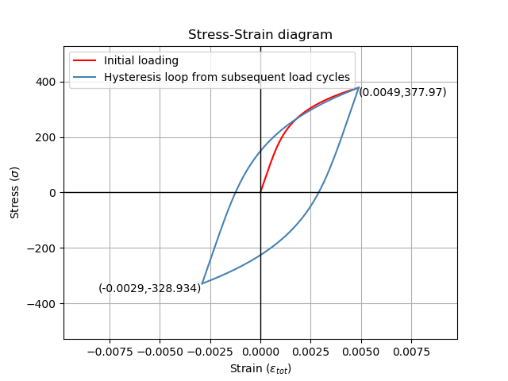

.. image:: images/logo.png

-------------------------------------

Stress-strain and strain-life
'''''''''''''''''''''''''''''

.. note:: This module is currently in development. The following documentation is correct, however, the most recent version of ``reliability`` on PyPI will not contain this module until Dec 2018.

In the strain-life method of fatigue analysis, the elastic and plastic deformation of the material is used to determine how many cycles before failure. In this context, failure is defined as the formation of a small crack (typically 1mm) so the geometry of the material need not be considered provided the material peoperties have been accurately measured using a stress-strain test. This section of the documentation contains three functions which are useful in strain-life analysis. The first of these is useful to fit the stress-strain and strain-life models to available data, thereby providing the material properties. The second function is a diagram of the relationship between stress and strain during cyclic fatigue which shows the hysteresis loop and finds the min/max stress and strain. The third function produced the strain-life diagram and the equations for this diagram are used for calculating the number of cycles to failure. Further detail is available below for each of the respective functions.

Stress-Strain and Strain-Life parameter estimation
--------------------------------------------------

This function will use stress and strain data to calculate the stress-strain parameters: K, n.
If cycles is provided it will also produce the strain-life parameters: sigma_f, epsilon_f, b, c.
You cannot find the strain-life parameters without stress as we must use stress to find elastic strain.
Note that if you already have the parameters K, n, sigma_f, epsilon_f, b, c, then you can use the functions 'stress_strain_diagram' or 'strain_life_diagram' as described below.

Inputs:

- strain - an array or list of strain
- stress - an array or list of stress
- E - The modulus of elasticity. Ensure this is in the same units as stress (typically MPa)
- cycles - the number of cycles to failure. Optional input. Required if you want to obtain the parameters sigma_f, epsilon_f, b, c
- print_results - True/False. Default is True.
- show_plot - True/False. Default is True.

Outputs:

- The stress-strain plot will a be generated if show_plot is True. If cycles is provided then the strain-life plot will also be generated. Use plt.show() to show any plots.
- The results will be printed in the console if print_results is True.
- K - the cyclic strength coefficient
- n - the cyclic strain hardening exponent
- sigma_f - the fatigue strength coefficient. Only generated if cycles is provided.
- epsilon_f - the fatigue strain coefficient. Only generated if cycles is provided.
- b - the elastic strain exponent. Only generated if cycles is provided.
- c - the plastic strain exponent. Only generated if cycles is provided.

Note that the parameters generated are stored to an object, so you may find it useful to use this function with print_results=False and show_plot=False, and then access the calculated parameters later. This is done in the example for the stress-strain diagram.

In the example below, we provide data from a fatigue test including stress, strain, and cycles to failure. We also must provide the modulus of elasticity (E) for the material. All other options are left as default values. The plots shown below are provided and the results are printed to the console.  

.. code:: python

    from reliability.PoF import stress_strain_life_parameters_from_data
    import matplotlib.pyplot as plt
    strain_data = [0.02, 0.015, 0.01, 0.006, 0.0035, 0.002]
    stress_data = [650, 625, 555, 480, 395, 330]
    cycles_data = [200, 350, 1100, 4600, 26000, 560000]
    params = stress_strain_life_parameters_from_data(stress=stress_data, strain=strain_data,cycles=cycles_data, E=216000)
    plt.show()

    '''
    K (cyclic strength coefficient): 1462.4649152172044
    n (strain hardening exponent): 0.19810419512368083
    sigma_f (fatigue strength coefficient): 1097.405402055844
    epsilon_f (fatigue strain coefficient): 0.23664541556833998
    b (elastic strain exponent): -0.08898339316495743
    c (plastic strain exponent): -0.4501077996416115
    '''

.. image:: images/stress_strain_diagram_fitting.png

.. image:: images/stress_life_diagram_fitting.png

Stress-Strain diagram
---------------------

The stress strain diagram is used to visualise how the stress and strain vary with successive load cycles. Due to residual tensile and compressive stresses, the stress and strain in the material does not unload in the same way that it loads. This results in a hysteresis loop being formed and this is the basis for crack propagation in the material leading to fatigue failure. The size of the hysteresis loop increases for higher strains. Fatigue tests are typically strain controlled; that is they are subjected to a specifiedamount of strain throughout the test, typically in a sinusoidal pattern. Fatigue tests may also be stress controlled, whereby the material is subjected to a specified amount of stress. This function accepts either input (max_stress or max_strain) and will find the corresponding stress and strain as required. If you do not specify min_stress or min_strain then it is assumed to be negative of the maximum value. Currently the cyclic loading sequence begins with tension. For loading cycles with non-zero mean stresses, the results will be inaccurate if the sequence begins with compression.

When a min_stress or min_strain is specified that results in a non-zero mean stress, there are several mean stress correction methods that are available. These are 'morrow', 'modified_morrow' (also known as Manson-Halford) , and 'SWT' (Smith-Watson-Topper). Only the first three reversals are plotted. For most materials the shape of the hysteresis loop will change over many hundreds of cycles as a result of fatigue hardening (also known as work-hardening) or softening. More on this process is available in the `eFatigue training documents <https://www.efatigue.com/training/Chapter_5.pdf>`_. 

Note that if you do not have the parameters K, n, but you do have stress and strain data then you can use the function 'stress_strain_life_parameters_from_data'. This will be shown in the below example.

Inputs:

- K - cyclic strength coefficient
- n - strain hardening exponent
- E - The modulus of elasticity. Ensure this is in the same units for which K and n were obtained (typically MPa)
- max_strain - the maximum strain to use for cyclic loading when plotting the hysteresis loop.
- max_stress - the maximum stress to use for cyclic loading when plotting the hysteresis loop. When specifying min and max stress or strain, Do not specify both stress and strain as the corresponding value will be automatically calculated.
- min_strain - if this is not -max_strain then specify it here. Optional input. Only specify the min if it is not -max
- min_stress - if this is not -max_stress then specify it here. Optional input.

Outputs:

- The stress-strain plot will always be generated. Use plt.show() to show it.
- If print_results is True, the calculated parameters below will be printed.
- max_stress
- max_strain
- min_stress
- min_strain

In the example below, we are using the same data from the first example, but this time, we will store the calculated parameters in an object named 'params'. Then we can specify the calculated parameters to the stress_strain_diagram function. The hysteresis loop generated is for a strain-controlled fatigue test where the strain goes from -0.006 to +0.006.

.. code:: python

    from reliability.PoF import stress_strain_life_parameters_from_data, stress_strain_diagram
    import matplotlib.pyplot as plt
    strain_data = [0.02, 0.015, 0.01, 0.006, 0.0035, 0.002]
    stress_data = [650, 625, 555, 480, 395, 330]
    cycles_data = [200, 350, 1100, 4600, 26000, 560000]
    params = stress_strain_life_parameters_from_data(stress=stress_data, strain=strain_data, cycles=cycles_data, E=216000, show_plot=False, print_results=False)
    stress_strain_diagram(E = 216000,n = params.n, K = params.K, max_strain=0.006)
    plt.show()

    '''
    Max stress: 483.85816239406745
    Min stress: -483.8581623940621
    Max strain: 0.006
    Min strain: -0.006
    '''

.. image:: images/stress_strain_hysteresis.png

In this second example, we will use the stress_strain_diagram to visualise the effects of residual stresses for a material subjected to non-zero mean stress. The material parameters (K and n) are already known so we do not need to obtain them from any data. We specify the max_stress is 378 MPa and the min_stress is -321 MPa. Upon inspection of the results we see the Min stress in the material is actually -328.893 MPa which exceeds the min_stress we specified in out test. This result is not an error and is caused by the residual stresses in the material that were formed during the first tensile loading cycle. When the material was pulled apart in tension, the material pulls back but due to plastic deformation, these internal forces in the material are not entirely removed, such that when the first compressive load peaks, the material's internal stresses add to the external compressive forces. This phenomena is important in load sequence effects for variable amplitude fatigue.

stress_strain_diagram(E=210000, K = 1200, n = 0.2, max_stress=378,min_stress=-321)

.. code:: python

    from reliability.PoF import stress_strain_diagram
    import matplotlib.pyplot as plt
    stress_strain_diagram(E=210000, K = 1200, n = 0.2, max_stress=378,min_stress=-321)
    plt.show()

    '''
    Max stress: 378.0
    Min stress: -328.8931121800317 #note that this is different from our specified min_stress
    Max strain: 0.004901364196875
    Min strain: -0.0028982508530831477
    '''

Strain-Life diagram
-------------------

This function be written soon.
