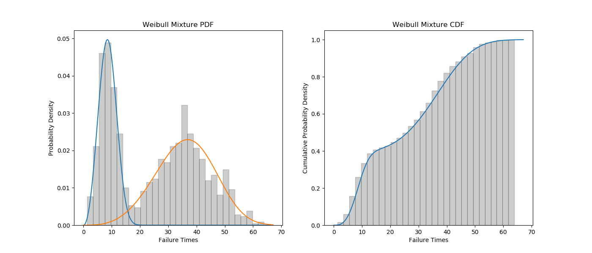
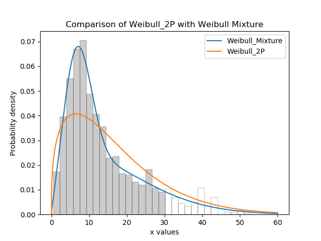

.. _code_directive:

.. image:: images/logo.png

-------------------------------------

Weibull mixture models
''''''''''''''''''''''

Mixture models are formed using two or more distributions added together. Each of the mixture's components must be multiplied by a proportion, and the sum of all the proprotions is equal to 1. Mixture models are useful when there is more than one failure mode that is generating the failure data. This can be recognised by the shape of the PDF and CDF being outside of what any single distribution can accurately model. You should not use a mixture model just because it can fit almost anything really well, but you should use a mixture model if you suspect that there are multiple failure modes contributing to the failure data you are observing.

Currently the only mixture model implemented in ``reliability`` is a Weibull mixture model consisting of 2 x Weibull_2P distributions (this does not fit the gamma parameter). Just as with all of the other distributions in Fitters, censoring is supported (left or right but not both), though care should be taken to ensure that there still appears to be two groups when plotting only the failure data. A second group cannot be made from a mostly or totally censored set of samples.

Whilst some failure modes may not be fitted as well by a Weibull distribution as they may be by another distribution, it is unlikely that a mixture of data from two distributions (particularly if they are overlapping) will be fitted noticeably better by other types of mixtures than would be achieved by a Weibull mixture. For this reason, other types of mixtures are not implemented.
 
inputs:
failures - an array or list of the failure data. There must be at least 4 failures, but it is highly recommended to use another model if you have less than 20 failures.
left_censored - an array or list of left censored data
right_censored - an array or list of right censored data
print_results - True/False. This will print results to console. Default is False
show_plot - True/False. This will show the PDF and CDF of the Weibull mixture with a histogram of the data. Default is False.
 
outputs:
alpha_1 - the fitted Weibull_2P alpha parameter for the first (left) group
beta_1 - the fitted Weibull_2P beta parameter for the first (left) group
alpha_2 - the fitted Weibull_2P alpha parameter for the second (right) group
beta_2 - the fitted Weibull_2P beta parameter for the second (right) group
proportion_1 - the fitted proportion of the first (left) group
proportion_2 - the fitted proportion of the second (right) group. Same as 1-proportion_1
loglik2 - LogLikelihood*-2
AICc - Akaike Information Criterion
BIC - Bayesian Information Criterion

In this first example, we will create some data using two Weibull distributions and then combine the data using np.hstack. We will then fit the Weibull mixture model to the combined data and will print the results and show the plot. As the input data is made up of 40% from the first group, we expect the proportion to be 0.4.

.. code:: python

    from reliability.Fitters import Fit_Weibull_Mixture
    from reliability.Distributions import Weibull_Distribution
    import numpy as np
    #create some failures and right censored data
    np.random.seed(2) #this is just for repeatability for this tutorial
    group_1 = Weibull_Distribution(alpha=10,beta=3).random_samples(400)
    group_2 = Weibull_Distribution(alpha=40,beta=4).random_samples(600)
    all_data = np.hstack([group_1,group_2])
    #fit the Weibull Mixture
    results = Fit_Weibull_Mixture(failures=all_data,show_plot=True,print_results=True)

    '''
    Parameters: 
    Alpha 1: 9.597584120116744 
    Beta 1: 3.103406441496059 
    Alpha 2: 39.70121344619987 
    Beta 2: 3.9380638152183587 
    Proportion 1: 0.39392990137955697
    '''

In this second example, we will compare how well the Weibull Mixture performs vs a standard Weibull_2P. Firstly, we generate some data from two weibull distributions, combine the data, and right censor it above our chosen threshold. Next, we fit the Mixture and Weibull_2P distributions. Then we build the mixture PDF using components of the fitted weibull components. Everything is then plotted and a goodness of fit measure is used to check whether the Weibull_Mixture is really a much better fit than a standard Weibull_2P distribution, which it is due to the lower BIC.

.. code:: python
  
    from reliability.Fitters import Fit_Weibull_Mixture, Fit_Weibull_2P
    from reliability.Distributions import Weibull_Distribution
    import numpy as np
    import matplotlib.pyplot as plt
    #create some failures and right censored data
    np.random.seed(2) #this is just for repeatability for this tutorial
    group_1 = Weibull_Distribution(alpha=10,beta=2).random_samples(700)
    group_2 = Weibull_Distribution(alpha=30,beta=3).random_samples(300)
    all_data = np.hstack([group_1,group_2])
    failures = []
    censored = []
    threshold = 30
    for item in all_data:
        if item>threshold:
            censored.append(threshold)
        else:
            failures.append(item)

    #fit the Weibull Mixture and Weibull_2P
    mixture = Fit_Weibull_Mixture(failures=failures,right_censored=censored)
    single = Fit_Weibull_2P(failures=all_data,right_censored=censored)

    #plot the histogram of all the data and shade the censored part white
    N,bins,patches = plt.hist(all_data, density=True, alpha=0.2, color='k', bins=30, edgecolor='k')
    for i in range(np.argmin(abs(np.array(bins)-threshold)),len(patches)): #this is to shade the censored part of the histogram as white
        patches[i].set_facecolor('white')
    
    #extract the y_vals from the mixture and build the Mixture PDF using the proportions
    xvals = np.linspace(0,60,1000)
    part_1 = Weibull_Distribution(alpha=mixture.alpha_1,beta=mixture.beta_1).PDF(xvals=xvals,show_plot=False)
    part_2 = Weibull_Distribution(alpha=mixture.alpha_2,beta=mixture.beta_2).PDF(xvals=xvals,show_plot=False)
    Mixture_PDF = part_1*mixture.proportion_1+part_2*mixture.proportion_2
    
    #plot the Mixture and Weibull_2P
    plt.plot(xvals,Mixture_PDF,label='Weibull_Mixture')
    Weibull_Distribution(alpha=single.alpha,beta=single.beta).PDF(xvals=xvals,label='Weibull_2P')
    plt.title('Comparison of Weibull_2P with Weibull Mixture')
    plt.legend()
    plt.show()
    
    #print the goodness of fit measure
    print('Weibull_Mixture BIC:',mixture.BIC,'\nWeibull_2P BIC:',single.BIC)

    '''
    Weibull_Mixture BIC: 6422.214522142318 
    Weibull_2P BIC: 7571.421531337183
    '''

