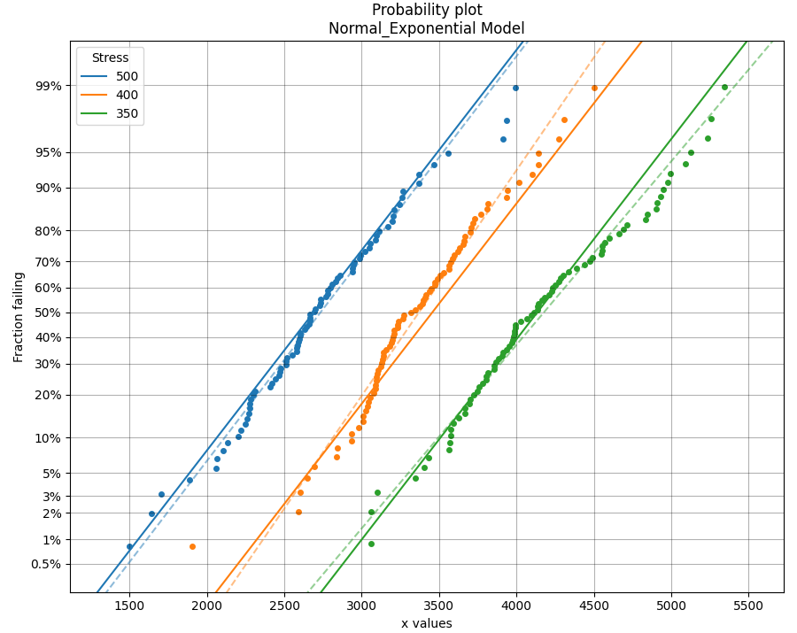

.. image:: images/logo.png

-------------------------------------

What does an ALT probability plot show me
'''''''''''''''''''''''''''''''''''''''''

An ALT probability plot shows us how well our dataset can be modeled by the chosen distribution. This is more than just a goodness of fit at each stress level, because the distribution needs to be a good fit at all stress levels and be able to fit well with a common shape parameter. If you find the shape parameter changes significantly as the stress increases then it is likely that your accelerated life test is experiencing a different failure mode at higher stresses. When examining an ALT probability plot, the main things we are looking for are:

- Does the model appear to fit the data well at all stress levels (ie. the dashed lines pass reasonably well through all the data points)
- Examine the AICc and BIC values when comparing multiple models. A lower value suggests a better fit.
- Is the amount of change to the shape parameter within the acceptable limits (generally less than 50% for each distribution).

The following example fits 2 models to ALT data that is generated from a Normal_Exponential model. The first plot is an example of a good fit. The second plot is an example of a very bad fit. Notice how a warning is printed in the output telling the user that the shape parameter is changing too much, indicating the model may be a poor fit for the data. Also note that the total AIC and total BIC for the Exponential_Power model is higher (worse) than for the Normal_Exponential model.

If you are uncertain about which model you should fit, try `fitting everything <https://reliability.readthedocs.io/en/latest/Fitting%20all%20available%20models%20to%20ALT%20data.html>`_ and select the best fitting model.

If you find that none of the models work without large changes to the shape parameter at the higher stresses, then you can conclude that there must be a change in the failure mode for higher stresses and you may need to look at changing the design of your accelerated test to keep the failure mode consistent across tests.

Example 1
---------

.. code:: python

    from reliability.Other_functions import make_ALT_data
    from reliability.ALT_fitters import Fit_Normal_Exponential, Fit_Exponential_Power
    import matplotlib.pyplot as plt

    ALT_data = make_ALT_data(distribution='Normal',life_stress_model='Exponential',a=500,b=1000,sigma=500,stress_1=[500,400,350],number_of_samples=100,fraction_censored=0.2,seed=1)
    Fit_Normal_Exponential(failures=ALT_data.failures, failure_stress=ALT_data.failure_stresses, right_censored=ALT_data.right_censored, right_censored_stress=ALT_data.right_censored_stresses,show_life_stress_plot=False)
    print('---------------------------------------------------')    
    Fit_Exponential_Power(failures=ALT_data.failures, failure_stress=ALT_data.failure_stresses, right_censored=ALT_data.right_censored, right_censored_stress=ALT_data.right_censored_stresses,show_life_stress_plot=False)
    plt.show()
    
    '''
    Results from Fit_Normal_Exponential (95% CI):
    Analysis method: Maximum Likelihood Estimation (MLE)
    Failures / Right censored: 240/60 (20% right censored) 
    
    Parameter  Point Estimate  Standard Error  Lower CI  Upper CI
            a         501.729         27.5897   447.654   555.804
            b         985.894         70.4156   857.107   1134.03
        sigma         487.321         22.1255   445.829   532.674 
    
     stress  original mu  original sigma  new mu  common sigma sigma change
        500       2733.7         482.409 2689.22       487.321       +1.02%
        400      3369.57         432.749 3456.02       487.321      +12.61%
        350      4176.89         531.769 4134.25       487.321       -8.36%
    
     Goodness of fit    Value
     Log-likelihood -1833.41
               AICc  3672.89
                BIC  3683.93 

    If this model is being used for the Arrhenius Model, a = Ea/K_B ==> Ea = 0.04324 eV
    
    ---------------------------------------------------
    Results from Fit_Exponential_Power (95% CI):
    Analysis method: Maximum Likelihood Estimation (MLE)
    Failures / Right censored: 240/60 (20% right censored) 
    
    Parameter  Point Estimate  Standard Error  Lower CI   Upper CI
            a     4.23394e+06     1.10593e+07   25314.2 7.0815e+08
            n        -1.16747        0.433666  -2.01744  -0.317497 
    
     stress  weibull alpha  weibull beta  new 1/Lambda  common shape shape change
        500         2937.9       5.99874       2990.79             1      -83.33%
        400           3561       8.20311       3880.84             1      -87.81%
        350        4415.41        8.3864       4535.54             1      -88.08%
    The shape parameter has been found to change significantly (>50%) when fitting the ALT model.
    This may indicate that a different failure mode is acting at different stress levels or that the Exponential distribution may not be appropriate.
    
     Goodness of fit    Value
     Log-likelihood -2214.94
               AICc  4433.93
                BIC   4441.3 
    '''

**References:**

- Probabilistic Physics of Failure Approach to Reliability (2017), by M. Modarres, M. Amiri, and C. Jackson. pp. 136-168
- Accelerated Life Testing Data Analysis Reference - ReliaWiki, Reliawiki.com, 2019. [`Online <http://reliawiki.com/index.php/Accelerated_Life_Testing_Data_Analysis_Reference>`_].
