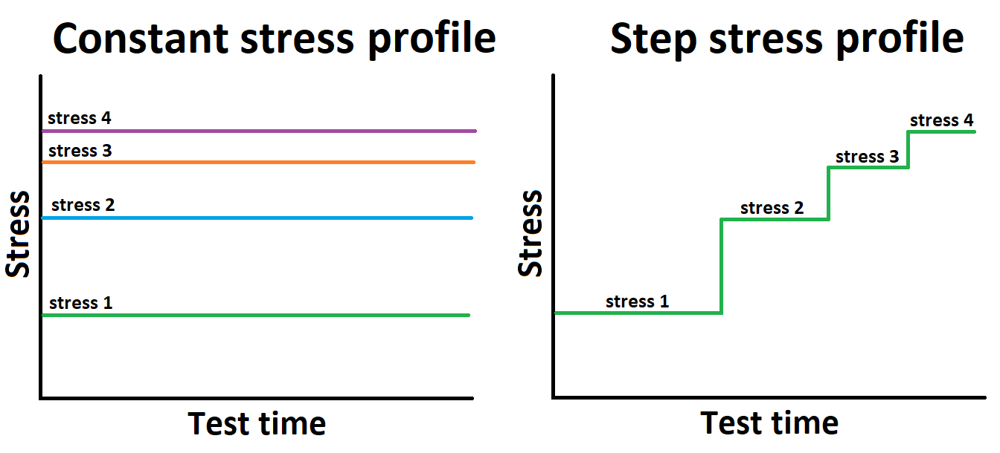

.. image:: images/logo.png

-------------------------------------

What is Accelerated Life Testing
''''''''''''''''''''''''''''''''

Accelerated life testing (ALT) is a method of test and analysis to determine how failures would likely occur in the future. ALT is a popular method of testing because of its ability to "speed up time". ALT is often used when we can not afford to wait for failures to occur at their normal rate but we need to know how failures are likely to occur in the future.

Consider an electronics manufacturer who wants to know how many failures will occur in 10 years (possibly for warranty purposes). If the component being tested has a mean life of 30 years, the manufacturer cannot reasonably spend several years performing a reliability test as they are ready to release their product on the market soon. By increasing the stress on the component, failure will be induced more rapidly. Done correctly, this is equivalent to speeding up the passage of time. The electronics manufacturer can collect failure data at a variety of stresses, fit the appropriate life-stress model, and then enter the "use stress" into the life-stress model to determine the failure distribution that is expected to occur at the use stress.

To ensure the ALT test is performed correctly, the analyst must ensure that the failure modes are the same at each stress. This will be evidenced by the shape parameter of the distribution as a changing shape parameter will show the failure mode is changing, though it is desirable that each failed component be examined to ensure that the failure mode being studied was the failure mode experienced. As with any model fitting the analyst must ensure there is sufficient data to fit the model such that the results are meaningful. This means the ALT test needs sufficient stresses (usually 3 or more) and sufficient failures (as many as you can afford to test) at each stress.

ALT tests may either be single stress or dual stress. In dual stress models, there are two stresses being tested, such as temerature and humidity. The testing process is largely the same though users should note that with an additional variable in the model it is highly desirable to have more failure data to fit the model accurately.

Types of ALT
""""""""""""

The way an ALT test is performed depends on the stress profile. There are two popular methods to perform an ALT test; using a constant stress profile, and using a step stress profile. In a constant stress profile, each item under test only ever experiences a single stress level. In a step stress profile each item begins at the lowest stress which is held for a period of time before being stepped up to higher and higher levels. Constant stress profiles are mathematically easier to fit and understand and therefore are more popular. Step stress profiles are useful when you only have a limited number of items and you do not know at what stress you should test them. Selecting a stress that is too low may result in no failures so the opportunity to use the same components (which have not yet failed) from the first test in subsequent tests at higher levels is advantageous. 

Within `reliability` there are 24 constant stress ALT models currently implemented (12 single stress and 12 dual stress). Step stress models are not yet implemented within `reliability` though this feature is planned for a future release. Users seeking to fit a step stress profile may want to consider using Reliasoft's `ALTA <http://reliawiki.com/index.php/Time-Varying_Stress_Models>`_.

The mathematical formulation of ALT models is explained further in the section on `Equations of ALT models <https://reliability.readthedocs.io/en/latest/Equations%20of%20ALT%20models.html>`_.

Highly Accelerated Life Testing
"""""""""""""""""""""""""""""""

Highly Accelerated Life Testing is when we want to know how things fail, rather than when things will fail. HALT has no survivors as the goal is to record the way in which items fails (its failure mode) so that design improvements can be made to make it more resistant to those failure modes. HALT is mostly qualitative while ALT is quantitative. Since HALT is qualitative, there are no models required for fitting failure data.

Further reading
"""""""""""""""

Reliasoft's `Accelerated Life Testing Data Analysis Reference <http://reliawiki.com/index.php/Accelerated_Life_Testing_Data_Analysis_Reference>`_ provides a great deal more information on ALT.
