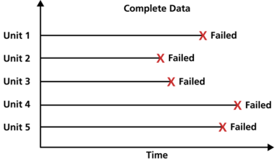
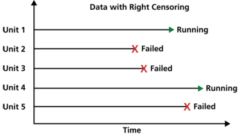
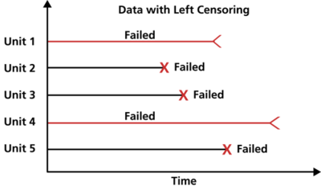
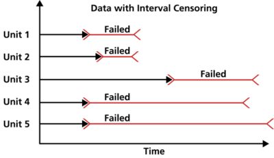

.. image:: images/logo.png

-------------------------------------

What is censored data
'''''''''''''''''''''

Censored data is any data for which we do not know the exact event time. There are three types of censored data; right censored, left censored, and interval cesored. Data for which the exact event time is known is referred to as complete data. In addition to the three types of censored data, there are also two ways in which censored data may be grouped; singly censored or multiply censored. Tests may be terminated after a certain time (time-terminated) or after an certain number of failures (failure-terminated). Each of these types of test termination lead to a different type of censoring (type I and type II censoring). An explaination of each of these terms is provided below.

In the context of reliability engineering we typically refer to events as "failures". In other industries a range of terminology may be used to describe events. These often include "deaths" if studying living things such as in medical studies, or simply "events" if studying natural phenomena like flood events. Throughout `reliability` we will use "failures" to describe events.

It is common to refer to data as "times" but a variety of other units of measure may also be used such as cycles, rounds, landings, etc. This depends on the type of data being collected and the units in which the life is measured. Throughout the Python reliability library we will use "times" to describe the units of measure of when failures occur.

Complete data
"""""""""""""

Complete data is data for which we know the exact failure time. This is seen when all items under analysis have their exact failure times recorded. For example if we have 10 components under test, all of these components fail during the test, and the exact failure time is recorded then we have complete data. It is common to have a mixture of complete and censored data as most tests will have some failures and some survivors. It is not possible to perform an anaysis with no failures and only right censored data. It is possible to perform analysis using all interval censored data as interval censoring (explained below) represents failures but the exact failure time is not known.

Right censored data
"""""""""""""""""""

Right censored data is data for items that have not yet failed. They are considered "still alive" as their failure time has not yet occurred, though it is expected to occur at some point in the future. For example, consider a fatigue test with 10 components under test. The test is run for 100000 cycles and during this time 8 of the components fail. We record the 8 failure times and we also record the end of the test as the "right censored" time for the 2 unfailed components. Right censored data is also referred to as "suspensions" or "survivors".

Left censored data
""""""""""""""""""

Left censored data is data for items that failed before the start of the test. Left censored data is the same as interval censored data, however the lower interval is 0. We rarely see this type of data in reliability engineering.

Interval censored data
""""""""""""""""""""""

Interval censored data is when the exact failure time is not known but the lower and upper bounds of an interval surrounding the failure are known. For example, consider a failure that is discovered as part of an overhaul (deeper maintenance event). The exact failure time is not known but we do know that the item had not failed at the time of the last overhaul and it did fail before the current overhaul. We record the lower and upper times and treat this failure as interval censored data.

We could consider all censored data to be interval censored data, with the following bounds:

- right censored data: lower bound = end of observation time, upper bound = infinity
- left censored data: lower bound = 0, upper bound = start of observation time
- interval censored data: lower bound = last observation time before failure, upper bound = first observation time after failure

Singly censored data
""""""""""""""""""""

This is not a type of censored data, but it used to describe how censored data is grouped. In singly censored data, all censoring times are the same. As an example we may have the following failures and right censored times (right censored represented by +): 50, 56, 78, 89, 100+, 100+, 100+. We can say this is "singly censored" as all the censoring occurs at a single point. This is often the case in a test where the end of the test is used as the same censoring time for all unfailed items.

Multiply censored data
""""""""""""""""""""""

This is not a type of censored data, but it used to describe how censored data is grouped. In multiply censored data, the censoring times occur at many different times. As an example we may have the following failures and right censored times (right censored represented by +): 50, 55+, 56, 72+, 74+, 78, 89, 98+. We can say this is "multiply censored" as the censoring times occur at multiple points. This is frequently seen when items have different start times or different amounts of usage so their times in service are not aligned. While the end of the observation period may be the same (in terms of the calendar date), the accumulated life will be different between items so their censoring times do not necessarily align.

Type I and Type II censoring
""""""""""""""""""""""""""""

If a test is stopped after a certain amount of time then the test is "time-terminated". This type of test will produce type I censoring. If a test is stopped after a certain number of failures then the test is "failure-terminated". This type of test will produce type II censoring. The formulas for some calculation methods (such as in some `MTBF calculations <https://reliability.readthedocs.io/en/latest/Reliability%20test%20planner.html>`_) differ between type I and type II censoring so it is important to know what type of censoring your test produces and whether the formulas being used need to be adjusted to reflect the type of censoring.

Considering failures as right censored
""""""""""""""""""""""""""""""""""""""

Items may fail by a variety of failure modes. If the failure modes are being analysed separately, we must consider any failures that did not occur via the failure mode under analysis, as right censored. Consider a fleet of vehicles with the following failures:

- Vehicle 1 - brake failure at 45000 km
- Vehicle 2 - brake failure at 37000 km
- Vehicle 3 - engine failure at 55000 km
- Vehicle 4 - battery failure at 28000 km
- Vehicle 5 - brake failure at 22000 km

If we are studying brake failures in our sample of 5 vehicles, we should use the following failure times: 22000, 28000+, 37000, 45000, 55000+. In this case the failures for vehicles 3 and 4 are treated as right censored data (shown with +) since the failure mode observed did not match the failure mode under analysis.
