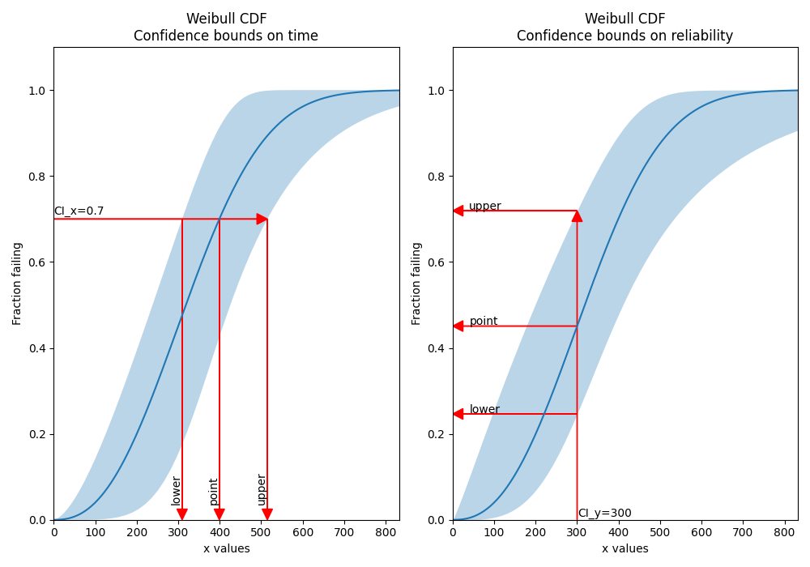
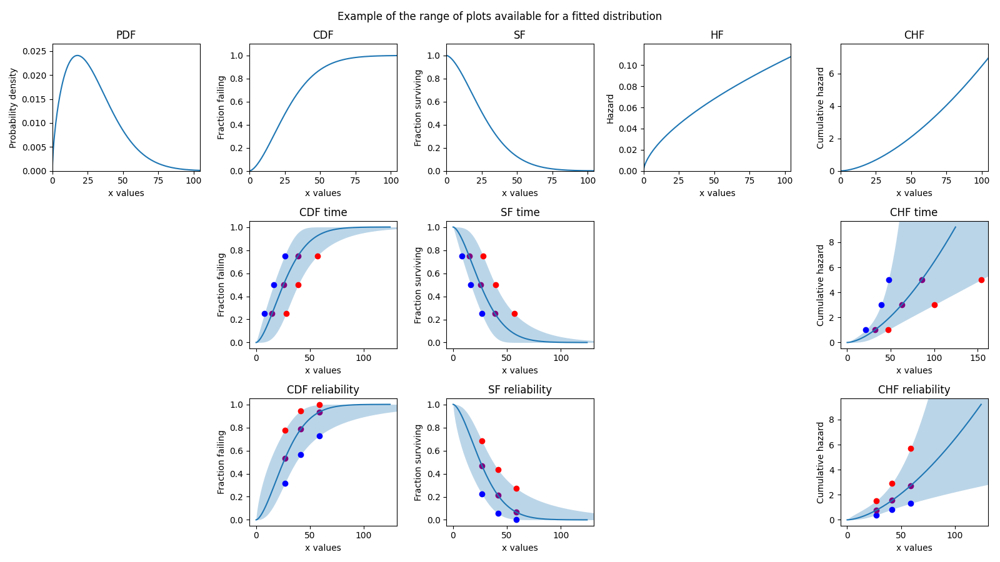
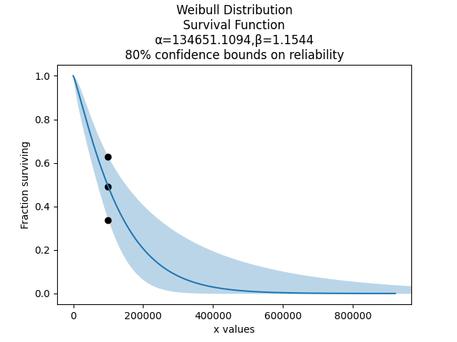

.. image:: images/logo.png

-------------------------------------

Working with fitted distributions
'''''''''''''''''''''''''''''''''

Probability distributions can be created by `specifying the parameters <https://reliability.readthedocs.io/en/latest/Creating%20and%20plotting%20distributions.html>`_ or by `fitting the model to data <https://reliability.readthedocs.io/en/latest/Fitting%20a%20specific%20distribution%20to%20data.html>`_.
The main difference between the two distribution objects is the presence of additional parameters required to generate the confidence bounds on the plot.
This document shows how a fitted distribution can be used to make certain predictions, with a focus on extracting values from the confidence bounds.

The additional parameters that are added to the distribution object when it is created by a Fitter are the standard error of each parameter (eg. alpha_SE, beta_SE) and the covariance between the parameters (e.g. Cov_alpha_beta).
The confidence interval is also required, though this defaults to 0.95 for 95% confidence bounds. It may be specified using the CI argument.

The confidence bounds available are bounds on time or bounds on reliability. For an detailed explaination of how these are calculated, please see the `theory document <https://reliability.readthedocs.io/en/latest/How%20are%20the%20confidence%20intervals%20calculated.html#confidence-intervals-on-the-plots>`_ on confidence intervals.
The important thing to note here is that they are different, and which one you should use depends on what you want to know.
If you want to know the system reliability at a certain time, then you are specifying time (CI_x) and seeking bounds on reliability (CI_type='reliability).
If you want to know the time that the system will reach a certain reliability, then you are specifying reliability (CI_y) and seeking bounds on time (CI_type='time).
Note that these are paired, so CI_y only works with CI_type='time' and CI_x only works with CI_type='reliability'. The only exception to this is the Exponential Distribution which does not accept CI_type since bounds on time and reliability are identical.

Example 1
---------

In this example, we see how the confidence bounds on time or reliability should be used based on what we are trying to predict.

.. code:: python

    from reliability.Distributions import Weibull_Distribution
    from reliability.Fitters import Fit_Weibull_2P
    import matplotlib.pyplot as plt
    
    dist = Weibull_Distribution(alpha=500,beta=3)
    data = dist.random_samples(10,seed=1)
    fit = Fit_Weibull_2P(failures=data,show_probability_plot=False,print_results=False)
    
    plt.figure(figsize=(10,7))
    plt.subplot(121)
    arrow_x = 25
    arrow_y = 0.025
    
    X_lower,X_point,X_upper = fit.distribution.CDF(CI_type='time',CI_y=[0.7])
    plt.arrow(x=0,y=0.7,dx=X_upper[0],dy=0,color='red',head_width=arrow_y,head_length=arrow_x,length_includes_head=True)
    plt.arrow(x=X_lower[0],y=0.7,dx=0,dy=-0.7,color='red',head_width=arrow_x,head_length=arrow_y,length_includes_head=True)
    plt.arrow(x=X_point[0],y=0.7,dx=0,dy=-0.7,color='red',head_width=arrow_x,head_length=arrow_y,length_includes_head=True)
    plt.arrow(x=X_upper[0],y=0.7,dx=0,dy=-0.7,color='red',head_width=arrow_x,head_length=arrow_y,length_includes_head=True)
    plt.xlim(0,dist.quantile(0.99))
    plt.ylim(0,1.1)
    plt.text(x=0,y=0.705,s='CI_x=[0.7]',va='bottom')
    plt.text(x=X_lower[0],y=0.035,s='lower',va='bottom',ha='right',rotation=90)
    plt.text(x=X_point[0],y=0.035,s='point',va='bottom',ha='right',rotation=90)
    plt.text(x=X_upper[0],y=0.035,s='upper',va='bottom',ha='right',rotation=90)
    plt.title('Weibull CDF\nConfidence bounds on time')
    
    plt.subplot(122)
    Y_lower,Y_point,Y_upper = fit.distribution.CDF(CI_type='reliability',CI_x=[300])
    plt.arrow(x=300,y=0,dx=0,dy=Y_upper[0],color='red',head_width=arrow_x,head_length=arrow_y,length_includes_head=True)
    plt.arrow(x=300,y=Y_lower[0],dx=-300,dy=0,color='red',head_width=arrow_y,head_length=arrow_x,length_includes_head=True)
    plt.arrow(x=300,y=Y_point[0],dx=-300,dy=0,color='red',head_width=arrow_y,head_length=arrow_x,length_includes_head=True)
    plt.arrow(x=300,y=Y_upper[0],dx=-300,dy=0,color='red',head_width=arrow_y,head_length=arrow_x,length_includes_head=True)
    plt.xlim(0,dist.quantile(0.99))
    plt.ylim(0,1.1)
    plt.text(x=301,y=0.001,s='CI_y=[300]',va='bottom')
    plt.text(x=40,y=Y_lower[0]+0.002,s='lower')
    plt.text(x=40,y=Y_point[0]+0.002,s='point')
    plt.text(x=40,y=Y_upper[0]+0.002,s='upper')
    
    plt.title('Weibull CDF\nConfidence bounds on reliability')
    plt.tight_layout()
    plt.show()

Example 2
---------

There are 5 plots available (PDF, CDF, SF, HF, CHF) and confidence bounds are only available for 3 of them (CDF, SF, CHF).
The following example shows how these plots can be generated, as well as extracting the confidence bounds (the red, purple, and blue points) using CI_x and CI_y.
You can also turn off the confidence bounds if you set plot_CI=False.

.. code:: python

    import matplotlib.pyplot as plt
    from reliability.Distributions import Weibull_Distribution
    from reliability.Fitters import Fit_Weibull_2P
    
    dist = Weibull_Distribution(alpha=50,beta=2)
    data = dist.random_samples(10,seed=1)
    fit = Fit_Weibull_2P(failures=data,show_probability_plot=False,print_results=False)
    CI_x = [dist.quantile(0.25),dist.quantile(0.5),dist.quantile(0.75)]
    CI_y = [0.25,0.5,0.75]
    
    plt.figure(figsize=(16,9))
    plt.subplot(3,5,1)
    fit.distribution.PDF()
    plt.title('PDF')
    
    plt.subplot(3,5,2)
    fit.distribution.CDF(plot_CI=False)
    plt.title('CDF')
    
    plt.subplot(3,5,7)
    lower, point, upper = fit.distribution.CDF(CI_y=CI_y,CI_type='time')
    plt.scatter(lower,CI_y,color='blue')
    plt.scatter(point,CI_y,color='purple')
    plt.scatter(upper,CI_y,color='red')
    plt.title('CDF time')
    
    plt.subplot(3,5,12)
    lower, point, upper = fit.distribution.CDF(CI_x=CI_x,CI_type='rel')
    plt.scatter(CI_x,lower,color='blue')
    plt.scatter(CI_x,point,color='purple')
    plt.scatter(CI_x,upper,color='red')
    plt.title('CDF reliability')
    
    plt.subplot(3,5,3)
    fit.distribution.SF(plot_CI=False)
    plt.title('SF')
    
    plt.subplot(3,5,8)
    lower, point, upper = fit.distribution.SF(CI_y=CI_y,CI_type='time')
    plt.scatter(lower,CI_y,color='blue')
    plt.scatter(point,CI_y,color='purple')
    plt.scatter(upper,CI_y,color='red')
    plt.title('SF time')
    
    plt.subplot(3,5,13)
    lower, point, upper = fit.distribution.SF(CI_x=CI_x,CI_type='rel')
    plt.scatter(CI_x,lower,color='blue')
    plt.scatter(CI_x,point,color='purple')
    plt.scatter(CI_x,upper,color='red')
    plt.title('SF reliability')
    
    plt.subplot(3,5,4)
    fit.distribution.HF()
    plt.title('HF')
    
    plt.subplot(3,5,5)
    fit.distribution.CHF(plot_CI=False)
    plt.title('CHF')
    
    plt.subplot(3,5,10)
    CI_y_chf = [1,3,5]
    lower, point, upper = fit.distribution.CHF(CI_y=CI_y_chf,CI_type='time')
    plt.scatter(lower,CI_y_chf,color='blue')
    plt.scatter(point,CI_y_chf,color='purple')
    plt.scatter(upper,CI_y_chf,color='red')
    plt.title('CHF time')
    
    plt.subplot(3,5,15)
    lower, point, upper = fit.distribution.CHF(CI_x=CI_x,CI_type='rel')
    plt.scatter(CI_x,lower,color='blue')
    plt.scatter(CI_x,point,color='purple')
    plt.scatter(CI_x,upper,color='red')
    plt.title('CHF reliability')
    
    plt.suptitle('Example of the range of plots available for a fitted distribution')
    plt.tight_layout()
    plt.show()

Example 3
---------

Now, let's get into a realistic example. We begin by importing the automotive dataset from the Datasets module.
This dataset provides failure times (in miles) and right censored times (in miles) for a fleet of vehicles on test.
We will fit a Weibull Distribution, and then from the fitted distribution, we want to know the system reliability after 100000 miles.

.. code:: python

    from reliability.Datasets import automotive
    from reliability.Fitters import Fit_Weibull_2P
    import matplotlib.pyplot as plt
    
    fit = Fit_Weibull_2P(failures=automotive().failures,right_censored=automotive().right_censored,show_probability_plot=False)
    
    # we want to know the system reliability after 100000 miles
    lower,point,upper = fit.distribution.SF(CI_x=[100000],CI_type='reliability',CI=0.8)
    plt.scatter([100000,100000,100000],[lower[0],point[0],upper[0]],color='black')
    
    print('Failures:',automotive().failures)
    print('Right censored:',automotive().right_censored)
    print('')
    print("The 80% reliability estimates at 100000 miles are:")
    print("lower bound: "+"{:.2%}".format(lower[0]))
    print("point estimate: "+"{:.2%}".format(point[0]))
    print("upper bound: "+"{:.2%}".format(upper[0]))
    plt.show()

    '''
    Results from Fit_Weibull_2P (95% CI):
    Analysis method: Maximum Likelihood Estimation (MLE)
    Optimizer: TNC
    Failures / Right censored: 10/21 (67.74194% right censored) 
    
    Parameter  Point Estimate  Standard Error  Lower CI  Upper CI
        Alpha          134651         42767.3   72252.9    250937
         Beta         1.15443         0.29614  0.698249   1.90863 
    
    Goodness of fit    Value
     Log-likelihood -128.974
               AICc  262.376
                BIC  264.816
                 AD  35.6052 
    
    Failures: [5248, 7454, 16890, 17200, 38700, 45000, 49390, 69040, 72280, 131900]
    Right censored: [3961, 4007, 4734, 6054, 7298, 10190, 23060, 27160, 28690, 37100, 40060, 45670, 53000, 67000, 69630, 77350, 78470, 91680, 105700, 106300, 150400]
    
    The 80% reliability estimates at 100000 miles are:
    lower bound: 33.83%
    point estimate: 49.20%
    upper bound: 62.87%
    '''

