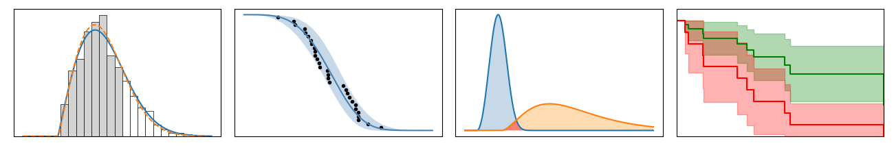

.. image:: images/logo.png

-------------------------------------

|pypi| |docs| |build| |code quality| |downloads| |license| |LOC| |DOI| |colab| |donate|

.. |docs| image:: https://readthedocs.org/projects/reliability/badge/?version=latest
    :alt: Documentation Status
    :scale: 100%
    :target: https://reliability.readthedocs.io/en/latest/

.. |pypi| image:: https://badge.fury.io/py/reliability.svg
    :alt: PyPI package
    :scale: 100%
    :target: https://badge.fury.io/py/reliability

.. |build| image:: https://travis-ci.com/MatthewReid854/reliability.svg?branch=master
    :alt: PyPI package
    :scale: 100%
    :target: https://travis-ci.com/github/MatthewReid854/reliability

.. |code quality| image:: https://img.shields.io/lgtm/grade/python/g/MatthewReid854/reliability.svg?logo=lgtm&logoWidth=18
    :alt: code quality: python
    :scale: 100%
    :target: https://lgtm.com/projects/g/MatthewReid854/reliability/context:python

*reliability* is a Python library for reliability engineering and survival analysis. It significantly extends the functionality of scipy.stats and also includes many specialist tools that are otherwise only available in proprietary software.

Contents:
============

.. toctree::
  :maxdepth: 1
  :caption: Quickstart & Intro

  Quickstart for reliability
  Introduction to the field of reliability engineering
  Recommended resources

.. toctree::
  :maxdepth: 1
  :caption: Parametric Models

  Equations of supported distributions
  Creating and plotting distributions
  Fitting a specific distribution to data
  Fitting all available distributions to data
  Mixture models
  Competing risk models

.. toctree::
  :maxdepth: 1
  :caption: Probability Plotting

  Probability plots
  Quantile-Quantile plots
  Probability-Probability plots

.. toctree::
  :maxdepth: 1
  :caption: Non-parametric models

  Kaplan-Meier estimate of reliability
  Nelson-Aalen estimate of reliability

.. toctree::
  :maxdepth: 1
  :caption: Stress-Strength Interference
  
  Stress-Strength interference for any distributions
  Stress-Strength interference for normal distributions

.. toctree::
  :maxdepth: 1
  :caption: Repairable systems
  
  Reliability growth
  Optimal replacement time
  ROCOF
  Mean cumulative function

.. toctree::
  :maxdepth: 1
  :caption: Physics of failure

  SN diagram
  Stress-strain and strain-life
  Fracture mechanics
  Creep
  Palmgren-Miner linear damage model
  Acceleration factor
  Solving simultaneous equations with sympy

.. toctree::
  :maxdepth: 1
  :caption: Accelerated Life Testing

  ALT probability plots
  Fitting a model to ALT data

.. toctree::
  :maxdepth: 1
  :caption: Other functions and data
  
  Similar Distributions
  Convert dataframe to grouped lists
  Crosshairs
  Histogram
  Make right censored data
  Datasets

.. toctree::
  :maxdepth: 1
  :caption: Reliability testing
  
  One sample proportion
  Two proportion test
  Sample size required for no failures
  Sequential sampling chart
  Reliability test planner
  Reliability test duration

.. toctree::
  :maxdepth: 1
  :caption: Administration
  
  Changelog
  Development roadmap
  Citing reliability in your work
  How to request or contribute a new feature
  How to get help
  How to donate to the project
  About the author
  Credits to those who helped
