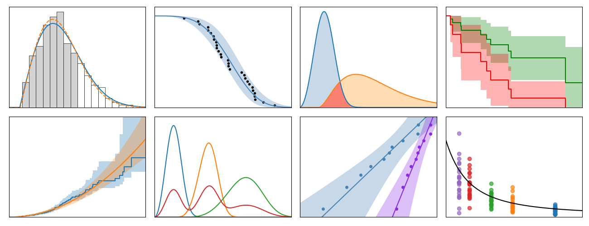

.. image:: images/logo.png

-------------------------------------

|pypi| |docs| |build and test| |code quality| |LOC| |downloads| |license| |DOI| |donate| |survey|

*reliability* is a Python library for `reliability engineering <https://en.wikipedia.org/wiki/Reliability_engineering>`_ and `survival analysis <https://en.wikipedia.org/wiki/Survival_analysis>`_. It significantly extends the functionality of scipy.stats and also includes many specialist tools that are otherwise only available in proprietary software.

If you frequently use the Python Reliability Library, please consider filling out a quick `survey <https://form.jotform.com/203156856636058>`_ to help guide the development of the library and this documentation.

Contents:
============

.. toctree::
  :maxdepth: 1
  :caption: Quickstart & Intro

  Quickstart for reliability
  Introduction to the field of reliability engineering
  Recommended resources

.. toctree::
  :maxdepth: 1
  :caption: Parametric Models

  Equations of supported distributions
  Creating and plotting distributions
  Fitting a specific distribution to data
  Fitting all available distributions to data
  Working with fitted distributions
  Mixture models
  Competing risk models
  DSZI models
  Optimizers

.. toctree::
  :maxdepth: 1
  :caption: Probability Plotting

  Probability plots
  Quantile-Quantile plots
  Probability-Probability plots

.. toctree::
  :maxdepth: 1
  :caption: Non-parametric models

  Kaplan-Meier
  Nelson-Aalen
  Rank Adjustment

.. toctree::
  :maxdepth: 1
  :caption: Accelerated Life Testing

  What is Accelerated Life Testing
  Equations of ALT models
  Getting your ALT data in the right format
  Fitting a single stress model to ALT data
  Fitting a dual stress model to ALT data
  Fitting all available models to ALT data
  What does an ALT probability plot show me

.. toctree::
  :maxdepth: 1
  :caption: Importing and converting data
 
  Datasets
  Importing data from Excel
  Converting data between different formats

.. toctree::
  :maxdepth: 1
  :caption: Repairable systems
  
  Reliability growth
  Optimal replacement time
  ROCOF
  Mean cumulative function

.. toctree::
  :maxdepth: 1
  :caption: Reliability testing
  
  One sample proportion
  Two proportion test
  Sample size required for no failures
  Sequential sampling chart
  Reliability test planner
  Reliability test duration
  Chi-squared test
  Kolmogorov-Smirnov test

.. toctree::
  :maxdepth: 1
  :caption: Physics of failure

  SN diagram
  Stress-strain and strain-life
  Fracture mechanics
  Creep
  Palmgren-Miner linear damage model
  Acceleration factor
  Solving simultaneous equations with sympy

.. toctree::
  :maxdepth: 1
  :caption: Other functions
  
  Stress-Strength interference
  Similar Distributions
  Make right censored data
  Make ALT data
  Crosshairs
  Distribution explorer
  Histogram

.. toctree::
  :maxdepth: 1
  :caption: Reliability Theory

  What is censored data
  How are the plotting positions calculated
  How does Least Squares Estimation work
  How does Maximum Likelihood Estimation work
  How are the confidence intervals calculated

.. toctree::
  :maxdepth: 1
  :caption: Administration
  
  Changelog
  Development roadmap
  Copyright information
  Citing reliability in your work
  Contributing
  How to get help
  How to donate to the project
  About the author
  Credits to those who helped
  Logo

.. toctree::
  :maxdepth: 3
  :caption: API reference

  API reference

.. |pypi| image:: https://img.shields.io/pypi/v/reliability?color=brightgreen&logo=Python&logoColor=white&label=PyPI%20package
    :alt: PyPI package
    :scale: 100%
    :target: https://pypi.org/project/reliability/

.. |docs| image:: https://img.shields.io/readthedocs/reliability/latest.svg?logo=read%20the%20docs&logoColor=white&label=Docs&version=latest
    :alt: docs
    :scale: 100%
    :target: https://reliability.readthedocs.io/en/latest/

.. |build and test| image:: https://github.com/MatthewReid854/reliability/workflows/Build%20and%20Test/badge.svg
    :alt: Build and Test
    :scale: 100%
    :target: https://github.com/MatthewReid854/reliability/actions

.. |code quality| image:: https://github.com/MatthewReid854/reliability/workflows/CodeQL/badge.svg
    :alt: CodeQL
    :scale: 100%
    :target: https://github.com/MatthewReid854/reliability/actions

.. |LOC| image:: https://sloc.xyz/github/MatthewReid854/reliability/?category=code
    :alt: lines of code
    :scale: 100%
    :target: https://github.com/MatthewReid854/reliability

.. |downloads| image:: https://static.pepy.tech/personalized-badge/reliability?period=month&units=international_system&left_color=grey&right_color=brightgreen&left_text=PyPI%20downloads/month
    :alt: downloads
    :scale: 100%
    :target: https://pepy.tech/project/reliability

.. |license| image:: https://img.shields.io/badge/License-LGPLv3-blue.svg?logo=GNU
    :alt: license
    :scale: 100%
    :target: https://www.gnu.org/licenses/lgpl-3.0.txt

.. |DOI| image:: https://img.shields.io/badge/DOI-10.5281/zenodo.3937999-blue.svg?logo=Buffer&logoColor=white
    :alt: DOI
    :scale: 100%
    :target: https://doi.org/10.5281/zenodo.3937999

.. |donate| image:: https://img.shields.io/badge/Support%20this%20project-grey.svg?logo=github%20sponsors
    :alt: donate
    :scale: 100%
    :target: https://reliability.readthedocs.io/en/latest/How%20to%20donate%20to%20the%20project.html

.. |survey| image:: https://img.shields.io/badge/Provide%20feedback-gray.svg?logo=Verizon
    :alt: donate
    :scale: 100%
    :target: https://form.jotform.com/203156856636058
